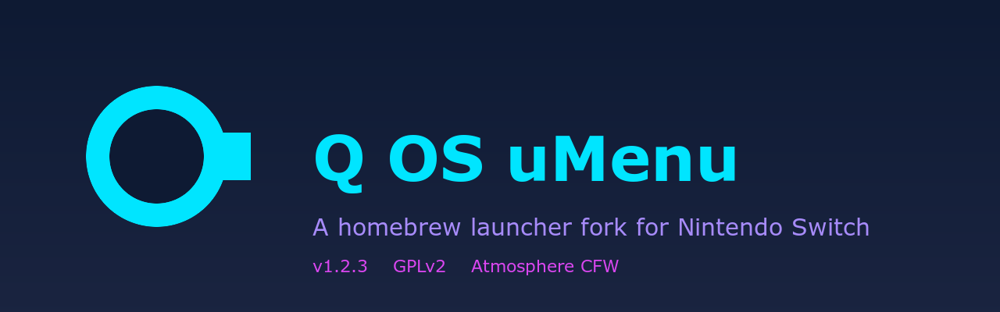

<div align="center">



**A homebrew launcher fork for Nintendo Switch**


</div>

## See it running

<div align="center">

https://github.com/Jmesmykil/uLaunch/raw/unew/assets/branding/qos-demo.mp4

[Download / view the demo video](assets/branding/qos-demo.mp4) (10 MB, 1080p, 64 seconds, 3x speed, no audio)

</div>

## What this is

This is a fork of XorTroll's uLaunch. uLaunch replaces the Switch home menu (qlaunch) so you can boot straight into a custom launcher instead of the stock Nintendo one. We took that base and reskinned it with the Q OS look, added a few new surfaces (Vault, Monitor, About, Launchpad), a top bar that actually fits the screen, and a desktop dock that works the way you expect a dock to work.

It runs on Atmosphere CFW. Stock Switch firmware is untouched. Pull the bundle out of `atmosphere/contents/` and you are back to the stock Nintendo home menu with zero side effects. That part matters and we keep it true.

## A real shoutout to the people who made this possible

This project would not exist without the work of these people. Read this part. They earned every line.

**XorTroll** built **uLaunch**, the Plutonium UI framework, the libnx-ext extensions, the arc result code generator, and the original uLoader hbloader replacement. Almost every system call we make traces back to code XorTroll wrote. The architecture, the IPC patterns, the theme system, the message queue, the menu state machine. All of it. We did not invent any of that. We forked it, reskinned it, added things on top.

GitHub: https://github.com/XorTroll

**Stary2001** is XorTroll's longtime collaborator on uLaunch and contributed substantially to the upstream codebase that we forked.

**The Atmosphere-NX team** ship the custom firmware everything runs on top of. **SciresM**, **TuxSH**, **hexkyz**, **fincs**, and the entire crew. Without Atmosphere there is no homebrew Switch scene. We use Atmosphere-libs (libstratosphere) for the sysmodule entry points, the message queue primitives, the result codes. Their CFW work made this category of project possible.

GitHub: https://github.com/Atmosphere-NX

**The switchbrew team** maintain **libnx**, the C library that gives us access to every Switch service. **fincs**, **plutoo**, **yellows8**, **WinterMute**, **shchmue**, and many more. Every `nsInitialize`, every `appletGetOperationMode`, every `usbCommsInitialize` call we make goes through libnx. Their reverse engineering work over the years is the only reason any of this works.

GitHub: https://github.com/switchbrew

**WinterMute** and the **devkitPro** maintainers ship devkitA64, the toolchain we compile against. devkitA64 is GCC plus Switch headers plus build templates. Everything Q OS uMenu compiles into runs because devkitPro packages exist.

GitHub: https://github.com/devkitPro

**The Sphaira team** ship the homebrew app store we plan to publish through. Their work on hb-appstore and the ForTheUsers infrastructure makes homebrew distribution actually usable for normal people.

GitHub: https://github.com/ITotalJustice/sphaira

**The Hekate team** (**CTCaer** and contributors) ship the bootloader chain we sit on top of. Hekate launches Atmosphere which launches our sysmodule. None of that boot path exists without Hekate.

GitHub: https://github.com/CTCaer/hekate

**Dear ImGui** by **ocornut** is in our libs tree (used by the legacy upstream uDesigner web tool). **stb** by **Sean T. Barrett** for the image and font primitives. **nlohmann/json** for the JSON parsing that drives the theme system. **kuba--/zip** for the zip handling. Each of these libraries solves a real problem cleanly and we use them gratefully.

If we missed your name and you should be on this list, open an issue and we will add you. The full attribution chain lives in [CREDITS.md](./CREDITS.md).

## Honest status

This release ships the K cycle work as of 2026-04-25. What that means concretely:

**Verified working on hardware**
* Top bar with battery, connection, time, date, all rendered at the right size in the right place
* Desktop grid with 9 columns by 5 rows of icons
* Dock with 5 builtin slots: Vault file browser, Monitor, Control panel, About, All Programs
* Launchpad full screen app grid (the "All Programs" view)
* Vault, Monitor, About, QSettings, QLockscreen as Q OS native surfaces
* Home button safely returns to the main menu from any subsurface
* B button safely returns from Launchpad to main menu
* Rebranded art assets across 29 PNGs (hero wallpaper, special entry icons, defaults, status overlays)

**Built but not yet visually verified by a human on the actual Switch**
* The full P2 plus P3 plus P4 art rebrand visually rendering as expected on the hardware screen
* The new lavender DockAllPrograms icon
* The K+5 test harness v2.0.0 in either normal mode or rig mode

**Designed but not yet implemented**
* K+1 Folders and Categories (Nintendo, Homebrew, Extras, Payloads sections)
* K+2 Settings and Filter chain (icon size picker, hide entries, favorites)
* K+3 Long press iPhone style edit mode with drag reorder
* K+4 Recent app LRU tracking
* Native companion apps to replace the upstream Java uScreen and WASM uDesigner (post-1.0 scope)
* L cycle Window Manager, Homebrew Window Launcher, Task Manager (the next big thing)

## What you get when you install this


The Q OS look. Cyan accent, deep navy base, magenta and lavender pops. The wallpaper is a single 1920 by 1080 PNG. The icons all use the same palette.


Settings, Album, Themes, Controllers, MiiEdit, WebBrowser, Amiibo, and the Empty slot placeholder. All eight rebuilt as Q OS originals. The upstream uLaunch icons are archived under `archive/upstream-art-p2/` for the full historical record.

## What ships in qos-umenu-v1.2.3

The release bundle is `qos-umenu-v1.2.3.zip` (and `.7z`). It contains exactly these artifacts:

| Artifact | Path on SD card | Notes |
|---|---|---|
| `exefs.nsp` | `atmosphere/contents/0100000000001000/exefs.nsp` | uSystem, replaces qlaunch |
| `main` | `ulaunch/bin/uMenu/main` | Q OS menu binary |
| `main.npdm` | `ulaunch/bin/uMenu/main.npdm` | Access control descriptor |
| `romfs.bin` | `ulaunch/bin/uMenu/romfs.bin` | Theme assets (29 Q OS original PNGs) |
| `uManager/` | `ulaunch/bin/uManager/` | Installer NRO assets |
| `uLoader/` | `ulaunch/bin/uLoader/` | hbloader replacement |
| `uManager.nro` | `switch/uManager.nro` | Homebrew management app |

The 29 original PNGs in `romfs.bin` are P1 through P4 of the rebrand: 5 hero assets, 8 SpecialEntry icons, 9 defaults and chrome pieces, and 7 status overlays. All generated in the Q OS brand palette and released under GPLv2.

## Install

You need:
* A Nintendo Switch with Atmosphere CFW already working (we do not cover Atmosphere setup here, the [Atmosphere README](https://github.com/Atmosphere-NX/Atmosphere) is the source of truth for that)
* Hekate or fusee as your bootloader (Hekate recommended)
* SD card mounted on your computer

Drop the contents of the release zip onto your SD card root. The directory layout matches what Atmosphere expects:
```
sdmc:/atmosphere/contents/0100000000001000/exefs.nsp    (uSystem, replaces qlaunch)
sdmc:/ulaunch/bin/uMenu/main                             (the Q OS menu binary)
sdmc:/ulaunch/bin/uMenu/main.npdm
sdmc:/ulaunch/bin/uMenu/romfs.bin                        (theme assets)
sdmc:/ulaunch/bin/uManager/                              (the installer NRO assets)
sdmc:/ulaunch/bin/uLoader/                               (the hbloader replacement)
sdmc:/switch/uManager.nro                                (homebrew app for managing things)
```

Eject the SD card properly. Boot into Hekate. Launch Atmosphere CFW. Q OS uMenu loads instead of the stock home menu.

To uninstall, delete `sdmc:/atmosphere/contents/0100000000001000/exefs.nsp` and reboot. Stock home menu returns.

## Build from source

Requirements:
* macOS or Linux (we develop on macOS)
* devkitPro with devkitA64 installed at `/opt/devkitpro`
* The following packages: `switch-sdl2`, `switch-freetype`, `switch-glad`, `switch-libdrm_nouveau`, `switch-sdl2_gfx`, `switch-sdl2_image`, `switch-sdl2_ttf`, `switch-sdl2_mixer`, `build_romfs`
* Git submodules initialized: `git submodule update --init --recursive` inside `src/`

Build everything:
```
cd src
make package
```

Output goes to `src/SdOut/` and zips up as `qos-umenu-v1.2.3.zip` and `.7z`.

Build just the menu without packaging:
```
cd src
make umenu
```

Output: `src/SdOut/ulaunch/bin/uMenu/main` and `romfs.bin`.

## What is next

The L cycle. Window manager. Replacing nx-hbloader with windowed homebrew launches. A task manager. The K cycle was about getting the desktop working solidly. The L cycle is about turning it into a real OS shaped thing where multiple apps run in windows and you can see what is happening. Design work is in flight as of this release.

## Contributing

Open issues. Open pull requests. We answer them. The codebase is GPLv2 and any contribution you make will ship under the same terms.

If you want to fork this and ship your own thing, do that too. That is what GPLv2 is for. Just keep the credit chain intact and open source your changes.

## License

GPLv2. Plutonium and Atmosphere-libs are GPLv2 and they propagate through static linking, so the whole project is GPLv2 too. We did not pick that, the upstream did, but we agree with the choice and we ship under the same terms.

The art assets (P1 through P4 = 29 PNGs across `romfs/default/ui/`) are Q OS originals, also released under GPLv2 to keep the bundle license consistent.

## Where to find us

* Issues: open them on this repo
* Q OS umbrella project: https://github.com/Jmesmykil/QOS
* Upstream uLaunch (read this if you want to understand the architecture): https://github.com/XorTroll/uLaunch

Built with respect for everyone whose code we are standing on.
