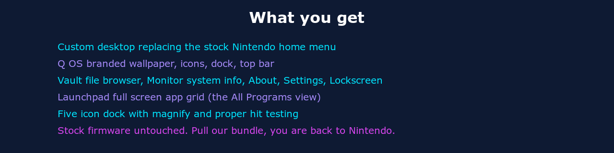

<div align="center">


**A custom operating system for Nintendo Switch. Built on uLaunch as the root source.**


</div>

## Hey

This is Q OS. A custom operating system for the Nintendo Switch.

It is not just a reskin. It is a desktop environment metaphor running where the stock Nintendo home menu used to live. Wallpaper. Dock. Top bar. File browser. System monitor. Lockscreen. Settings panel. Full screen app grid like the All Programs view on a real desktop OS. All of it on Switch hardware, all of it through Atmosphere CFW, all of it removable in one delete if you ever want stock Nintendo back.

uLaunch is the root source. XorTroll wrote the sysmodule that lets a custom launcher take over the qlaunch process. Plutonium is the UI framework underneath. We forked both and built Q OS on top.

Nobody has built a real desktop OS experience on Switch homebrew before. This is that.

This is a solo project. One person. The upstream giants whose names are in the credits. Nothing else.



## Why this is different

Switch homebrew has had launchers for years. uLaunch itself is years old and excellent. What Q OS adds:

* **Desktop environment metaphor** instead of menu metaphor. The screen is a desktop with a wallpaper, a dock at the bottom, a top bar at the top, icons on a grid. You think of it like a computer desktop, not a menu of options.
* **Native Q OS surfaces** built on top: Vault file browser. Monitor system info. About panel. QSettings. QLockscreen. Each one is a proper desktop app sitting on top of the wallpaper, with its own UI, not buried in a settings tree.
* **Launchpad** is the All Programs view. Press the dock icon to see every installed game and every homebrew NRO in one full screen grid with category headers. Search by typing. Like macOS Launchpad or Windows All Programs.
* **Q OS branded art** end to end. Every visible PNG is original work in the Q OS palette. Cyan, navy, magenta, lavender. Twenty nine PNGs replaced. Upstream art preserved in `archive/upstream-art-*/` for the historical record.
* **Honest engineering**. The L cycle design doc spells out exactly what is feasible and what is not. NRO framebuffer capture is architecturally impossible in Atmosphere Phase 1.5 without forking the display stack. We say so. We design around it. Nobody pretends otherwise.

## Massive shoutout to the people who made this possible

Read this part. They earned every line.

**XorTroll** built **uLaunch** (the sysmodule that replaces qlaunch), **Plutonium** (the UI framework that draws every pixel), **libnx-ext** (the libnx extensions), **arc** (the Python tooling for result codes), **uLoader** (the custom hbloader), **uManager** (the installer NRO), **uScreen** (the Switch screen mirror over USB), and **uDesigner** (the WebAssembly theme editor). Almost every system call we make traces back to code XorTroll wrote.

GitHub: https://github.com/XorTroll

**Stary2001** is XorTroll's longtime collaborator on uLaunch. The upstream credit string in our codebase reads "uLaunch by XorTroll and Stary2001". Real credit, not a courtesy.

GitHub: https://github.com/Stary2001

**The Atmosphere-NX team** ship the custom firmware everything runs on. **SciresM**, **TuxSH**, **hexkyz**, **fincs**, and the entire crew. We use Atmosphere-libs (libstratosphere) for the sysmodule entry point, the message queue, the result codes. Without Atmosphere there is no homebrew Switch scene at all.

GitHub: https://github.com/Atmosphere-NX

**The switchbrew team** maintain **libnx**, the C library that gives us access to every Switch service. **fincs**, **plutoo**, **yellows8**, **WinterMute**, **shchmue**, and many more. Years of reverse engineering work made everything we do possible.

GitHub: https://github.com/switchbrew

**WinterMute** and **devkitPro** maintain devkitA64, the toolchain we compile against. Every Switch homebrew project uses devkitPro.

GitHub: https://github.com/devkitPro

**The Sphaira team** ship the homebrew app store. Our planned distribution channel.

GitHub: https://github.com/ITotalJustice/sphaira

**The Hekate team** (CTCaer and contributors) ship the bootloader chain we sit on top of.

GitHub: https://github.com/CTCaer/hekate

**Library authors:** **Dear ImGui** by **ocornut**, **stb** by **Sean T. Barrett**, **nlohmann/json** by **Niels Lohmann**, and **kuba--/zip**. Each library solves a real problem cleanly and we use them gratefully.

If your name should be here and is missing, open an issue. The full attribution is in [CREDITS.md](./CREDITS.md). The license chain is in [LICENSE-AUDIT.md](./LICENSE-AUDIT.md).

## Honest status

Q OS for Switch v1.2.3 is real working software, not vaporware. What that means:

**Working on hardware (verified)**
* Top bar (battery, connection, time, date) at correct sizes and positions
* Desktop grid 9 columns by 5 rows of installed apps and homebrew
* Dock with five Q OS builtins (Vault, Monitor, Control, About, All Programs)
* Launchpad full screen app grid with section headers (Applications, Homebrew, Built in)
* Vault, Monitor, About, QSettings, QLockscreen as Q OS native surfaces
* Home button safely returns from any subsurface to main desktop
* B button safely returns from Launchpad to main desktop
* 29 PNG art rebrand across hero wallpaper, special entry icons, defaults, status overlays

**Built but not yet visually verified on hardware**
* Full P2 + P3 + P4 art rebrand visually rendering as expected
* Lavender DockAllPrograms icon
* K+5 test harness v2.0.0 in either normal or rig mode

**Designed but not implemented yet**
* K+1 Folders and Categories (Nintendo, Homebrew, Extras, Payloads sections)
* K+2 Settings and Filter chain (icon size picker, hide entries, favorites)
* K+3 Long press iPhone style edit mode with drag reorder
* K+4 Recent app LRU tracking
* L cycle Window Manager + Homebrew Window Launcher + Task Manager (the next big thing)

Design SSOTs for everything in the "designed not implemented" bucket live in [docs/](./docs/).


The Q OS look. Cyan accent #00E5FF. Deep navy base #0E1A33. Magenta accent #D946EF. Lavender accent #A78BFA. White for legibility.


Settings, Album, Themes, Controllers, MiiEdit, WebBrowser, Amiibo, and the Empty slot placeholder. All eight rebuilt as Q OS originals. Upstream art archived under `archive/upstream-art-p2/` for the historical record.

## Install

You need:
* A Nintendo Switch with Atmosphere CFW already working (we do not cover Atmosphere setup; the [Atmosphere README](https://github.com/Atmosphere-NX/Atmosphere) is the source of truth)
* Hekate or fusee as your bootloader (Hekate recommended)
* SD card mounted on your computer

Drop the contents of the release zip onto your SD card root. The directory layout matches Atmosphere's expectations:

```
sdmc:/atmosphere/contents/0100000000001000/exefs.nsp    (Q OS uSystem, replaces stock qlaunch)
sdmc:/ulaunch/bin/uMenu/main                             (the Q OS desktop binary)
sdmc:/ulaunch/bin/uMenu/main.npdm
sdmc:/ulaunch/bin/uMenu/romfs.bin                        (theme assets)
sdmc:/ulaunch/bin/uManager/                              (installer NRO assets)
sdmc:/ulaunch/bin/uLoader/                               (custom hbloader for NRO chainload)
sdmc:/switch/uManager.nro                                (Q OS installer homebrew app)
```

Eject the SD card properly. Boot Hekate. Launch Atmosphere CFW. Q OS loads as the home screen instead of stock Nintendo.

To uninstall: delete `sdmc:/atmosphere/contents/0100000000001000/exefs.nsp` and reboot. Stock Nintendo home menu returns. No other side effects. Truly removable.

## Build from source

Requirements:
* macOS or Linux
* devkitPro with devkitA64 installed at `/opt/devkitpro`
* Packages: `switch-sdl2`, `switch-freetype`, `switch-glad`, `switch-libdrm_nouveau`, `switch-sdl2_gfx`, `switch-sdl2_image`, `switch-sdl2_ttf`, `switch-sdl2_mixer`, `build_romfs`
* Submodules initialized: `git submodule update --init --recursive`

Build the package:
```
make package
```
Output: `qos-umenu-v1.2.3.zip` and `.7z` in the repo root.

Build only the menu:
```
make umenu
```
Output: `SdOut/ulaunch/bin/uMenu/main` and `romfs.bin`.

Full version chain and build ritual is in [ROADMAP.md](./ROADMAP.md).

## What is next

The L cycle. Window manager so multiple Q OS apps can run on screen at once. Replacing nx-hbloader with windowed homebrew launches (where feasible; see honest finding in [docs/L-CYCLE-WINDOW-MANAGER-DESIGN.md](./docs/L-CYCLE-WINDOW-MANAGER-DESIGN.md)). A task manager that lists running processes with memory and CPU. The K cycle was about getting Q OS desktop solid. The L cycle is about turning it into a real OS shaped thing where multiple things run at once and you can see what is happening.

## Contributing

Open issues. Open pull requests. Solo project but contributions welcome.

GPLv2 throughout. Any contribution ships under the same terms.

If you want to fork this and ship your own thing, that is what GPLv2 is for. Keep the credit chain intact.

## License

GPLv2. Plutonium and Atmosphere-libs are GPLv2 and they propagate through static linking. Whole project is GPLv2 too. Full audit in [LICENSE-AUDIT.md](./LICENSE-AUDIT.md).

The 29 Q OS branded art assets are originals released under GPLv2 to keep the bundle license consistent.

## Where this lives

* Repo (this fork): https://github.com/Jmesmykil/uLaunch
* Upstream uLaunch (read this to understand the architecture): https://github.com/XorTroll/uLaunch
* Atmosphere CFW: https://github.com/Atmosphere-NX/Atmosphere
* My Atmosphere fork (credit and tracking): https://github.com/Jmesmykil/Atmosphere

Built with respect for everyone whose code I am standing on.
